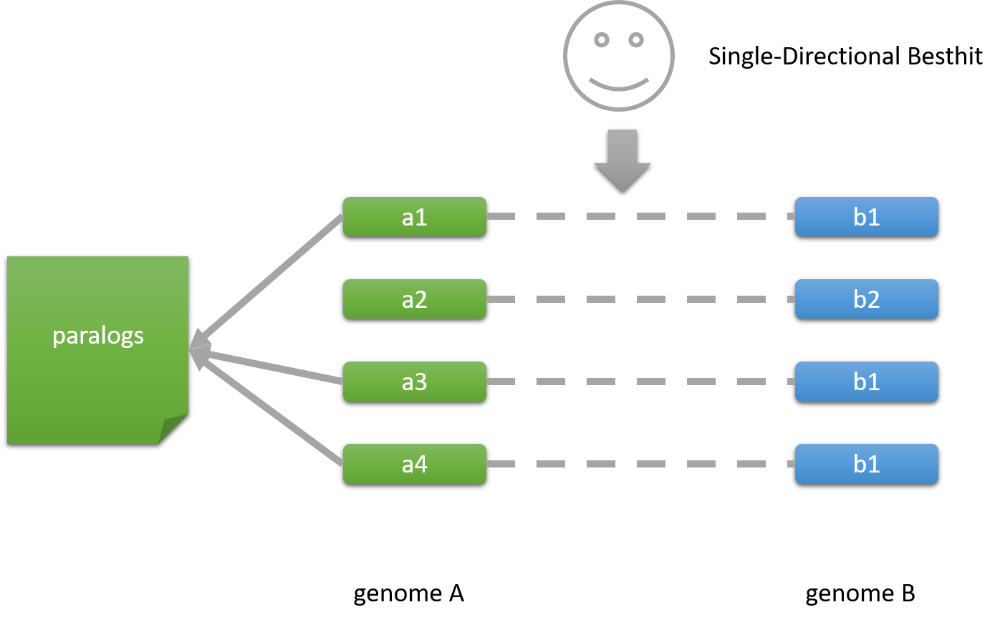

# KEGG pathway annotation

<!-- 2018-10-02 -->
<!-- :: course,dev,kegg,blastp -->


<div align="center">

<iframe src="//player.bilibili.com/player.html?aid=58675156&cid=102313656&page=1" 
			scrolling="no" 
			border="0" 
			frameborder="no" 
			framespacing="0" 
			allowfullscreen="true" 
			width="720" 
			height="480"> 
		</iframe>
<br />
<br />
</div>

For reconstruct the KEGG pathway network, we need the protein annotation data source from the UniProt database. We can export all of the protein sequence which with ``KO`` number have been assigned from Uniprot as the reference sequence. For build such reference sequence database, we can use the ``/Uniprot.KO.faa`` command from GCModeller ``localblast`` tool, for export the reference protein sequence.

```vbnet
''' <summary>
''' 从uniprot数据库之中导出具有KO编号的所有蛋白序列
''' </summary>
''' <param name="args"></param>
''' <returns></returns>
<ExportAPI("/UniProt.KO.faa")>
<Usage("/UniProt.KO.faa /in <uniprot.xml> [/lineBreak <default=120> /out <proteins.faa>]")>
<Description("Export all of the protein sequence from the Uniprot database which have KO number been assigned.")>
<Argument("/in", False, CLITypes.File, PipelineTypes.std_in,
		Extensions:="*.Xml",
		Description:="The Uniprot database which is downloaded from the Uniprot website or ftp site.")>
<Argument("/out", True, CLITypes.File, PipelineTypes.std_out,
		AcceptTypes:={GetType(FastaFile)},
		Extensions:="*.faa, *.fasta, *.fa",
		Description:="The file path of the export protein sequence, title of each sequence consist with these fields: ``KO|uniprot_id fullName|scientificName``")>
<Group(CLIGrouping.UniProtTools)>
Public Function ExportKOFromUniprot(args As CommandLine) As Integer
```

The cli command ``/UniProt.KO.faa`` takes one required input file and an optional output file parameter. The input file for this command could be download from Uniprot ftp site, you can download such Uniprot database for one specific genome from the Uniprot taxonomy entry or just download all of the bacteria genome data(Which could be up to 5GB to download).

Then, we could use the reference sequence database for bbh search




```vbnet
''' <summary>
''' 阈值筛选应该是发生在sbh导出的时候，在这里将不会做任何阈值筛选操作
''' </summary>
''' <param name="args"></param>
''' <returns></returns>
<ExportAPI("/UniProt.KO.assign")>
<Usage("/UniProt.KO.assign /in <query_vs_uniprot.KO.besthit> [/bbh <uniprot_vs_query.KO.besthit> /out <out.KO.csv>]")>
<Description("Assign KO number to query from Uniprot reference sequence database alignment result.")>
<Argument("/in", False, CLITypes.File, PipelineTypes.std_in,
			AcceptTypes:={GetType(BestHit)},
			Extensions:="*.csv",
			Description:="The sbh result of the alignment: query vs uniprot.KO.")>
<Argument("/bbh", True, CLITypes.File,
			AcceptTypes:={GetType(BestHit)},
			Extensions:="*.csv",
			Description:="If this argument is presents in the cli input, then it means we use the bbh method for assign the KO number to query. 
			Both ``/in`` and ``/bbh`` is not top best selection output. The input file for this argument should be the result of ``/SBH.Export.Large``
			command, and ``/keeps_raw.queryName`` option should be enabled for keeps the taxonomy information.")>
<Argument("/out", True, CLITypes.File, PipelineTypes.std_out,
			AcceptTypes:={},
			Extensions:="*.csv",
			Description:="Use the eggHTS command ``/proteins.KEGG.plot`` for export the final KO number assignment result table.")>
Public Function UniProtKOAssign(args As CommandLine) As Integer
```

### References

> [1] KEGG: Kyoto Encyclopedia of Genes and Genomes. DOI: 10.1093/nar/27.1.29
> [2] Gapped BLAST and PSI-BLAST: a new generation of protein database search programs. DOI: 10.1093/nar/25.17.3389
> [3] The use of gene clusters to infer functional coupling. DOI: 10.1073/pnas.96.6.2896
> [4] Bidirectional Best Hits Miss Many Orthologs in Duplication-Rich Clades such as Plants and Animals. DOI: 10.1093/gbe/evt132